# NESA Task Management System — MERN Workflow Documentation

> Generated from the current `master` branch of `MathewPaul2109/NESA-Task-Management`.
>
> This document describes the implemented application workflow at two levels:
> 1. **Complete system workflow** — from browser interaction through React, API/security layers, business logic, persistence, and asynchronous communication.
> 2. **Application-level workflow** — how users move through authentication, dashboards, projects, tasks, comments/chat, uploads, archiving, and administration.

## 1. System Overview

NESA Task Management is a full-stack task-management application organized as a React/Vite frontend and Node.js/Express backend with MongoDB/Mongoose persistence.

The repository contains:
- **Frontend:** React + Vite, React Router, Redux Toolkit, Tailwind CSS, REST API client, role-aware pages and components.
- **Backend:** Node.js + Express, JWT authentication, role authorization middleware, controllers, services, repositories, Mongoose models.
- **Database:** MongoDB via Mongoose.
- **Real-time:** Socket.IO is initialized by the backend and used by task/comment flows for live updates.
- **Email:** Nodemailer is used for password reset and task-assignment notifications.
- **Files:** Multer handles task file uploads and uploads are exposed through `/uploads`.
- **Audit:** activity logging records major operations such as task/project/role changes.

## 2. High-Level Architecture

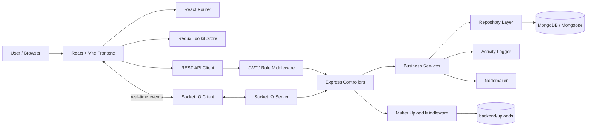

## 3. Complete Request/Response Workflow

### 3.1 Standard synchronous REST flow

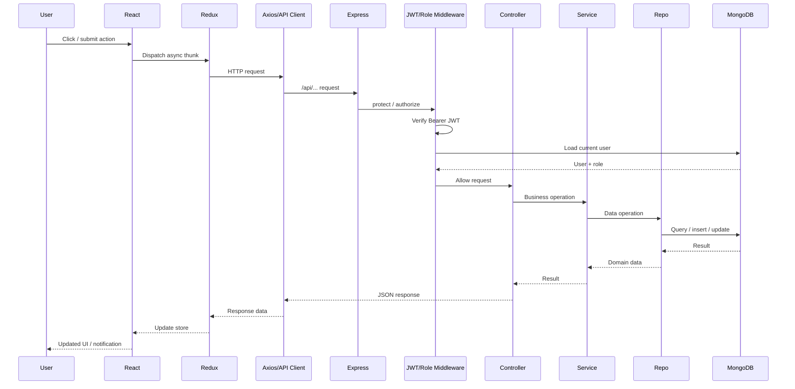

### 3.2 Authentication workflow

The application exposes public registration/login/password-reset endpoints and protected user endpoints. Successful login returns user information and a JWT. The frontend stores the authenticated user in the auth slice and routes the user to the correct dashboard.

```mermaid
flowchart TD
    A[Open application] --> B{Authenticated?}
    B -- No --> C[Login / Register]
    C --> D[POST /api/auth/login or /register]
    D --> E[Auth Controller]
    E --> F[Auth Service]
    F --> G[User Repository]
    G --> H[(MongoDB User)]
    H --> F
    F --> I[JWT generated]
    I --> J[Frontend auth state]
    J --> K{Role}
    K -- Admin --> L[/admin/dashboard]
    K -- Project Manager/User --> M[/user/dashboard]
    B -- Yes --> N[Protected route]
    N --> K
```

### 3.3 Frontend route protection

`PrivateRoute` checks whether a user exists in Redux. If not, the user is redirected to `/login`. When role restrictions are supplied, the component redirects an authenticated user to the appropriate dashboard when their role is not allowed.

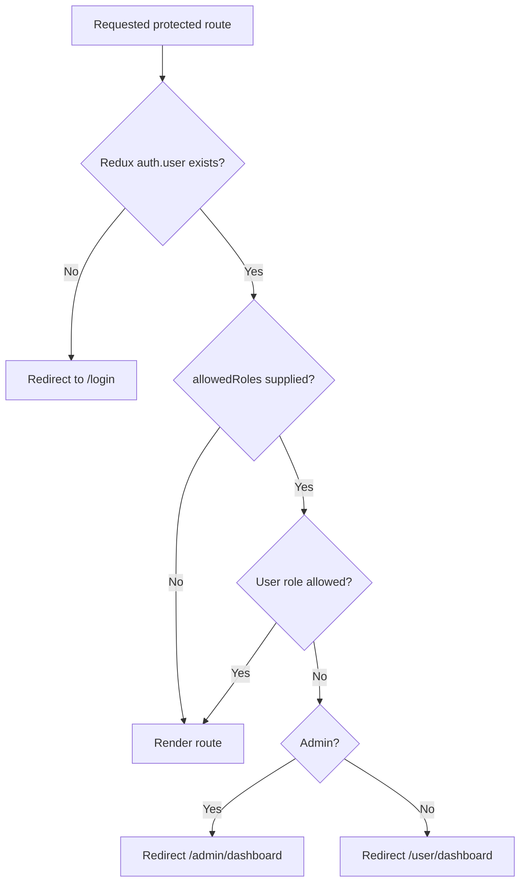

## 4. Application-Level Workflow

## 4.1 User journey

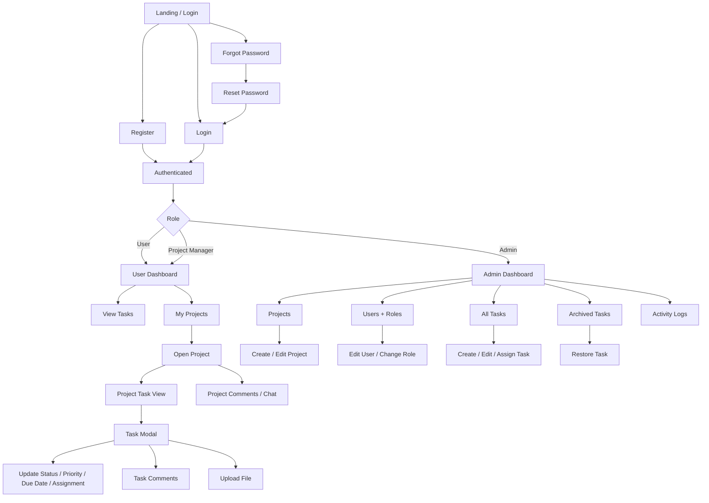

## 4.2 User dashboard and task lifecycle

The user-facing task workflow is centered on retrieving tasks, displaying them in the dashboard/Kanban UI, opening a task modal, and updating task state. The Redux task slice then updates the in-memory task list when API calls complete.

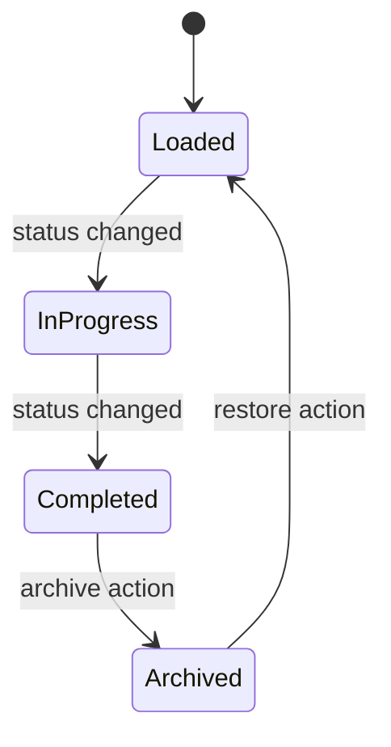

Typical task operation flow:

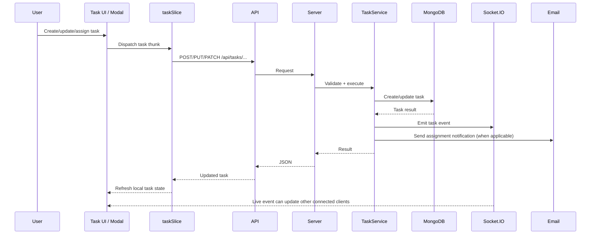

## 4.3 Project workflow

Projects are the organizational container for task work. The API supports listing and viewing projects for authenticated users, while creation/update is restricted to Admin and Project Manager roles and deletion is restricted to Admin.

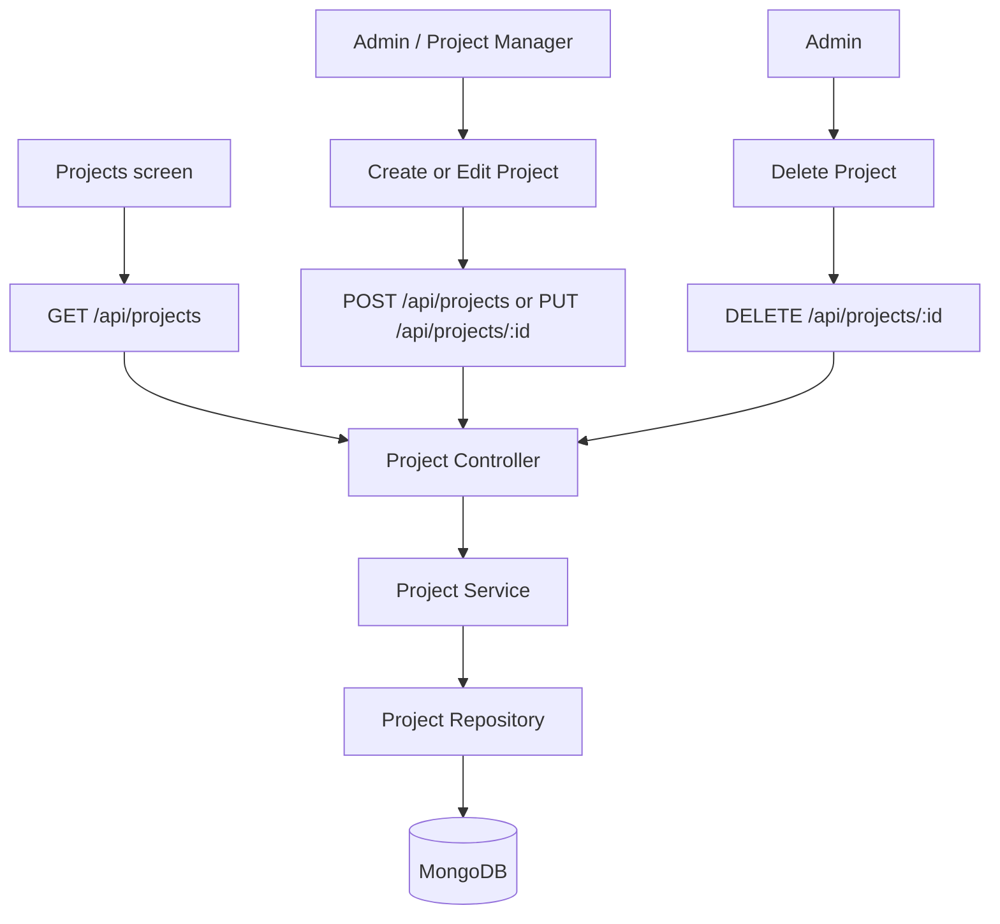

## 4.4 Comments and project chat workflow

The application supports comments at both the task level and project level. Redux has separate async operations for retrieving and adding task comments and project comments, plus an `appendComment` reducer for live updates.

```mermaid
flowchart LR
    UI[Task / Project Chat UI] -->|GET| API1[/api/comments/:taskId]
    UI -->|POST| API2[/api/comments/:taskId]
    UI -->|GET| API3[/api/comments/project/:projectId]
    UI -->|POST| API4[/api/comments/project/:projectId]

    API1 --> C[Comment Controller]
    API2 --> C
    API3 --> C
    API4 --> C
    C --> S[Comment Service]
    S --> R[Comment Repository]
    R --> DB[(MongoDB)]

    DB --> R --> S --> C --> UI
    WS[Socket.IO / real-time path] --> UI
```

## 4.5 File upload workflow

Task attachments are handled through an authenticated upload endpoint. The backend uses Multer and stores the uploaded file in the repository's `backend/uploads` directory; Express serves that directory under `/uploads`.

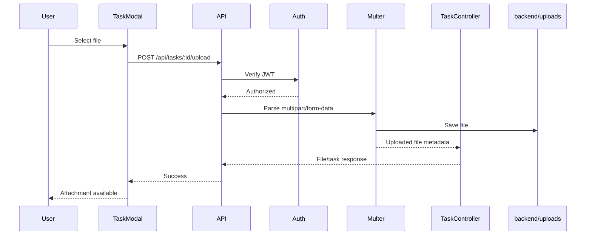

## 4.6 Activity logging workflow

Major operations are recorded through the backend logging utility. The project includes log-related routes, controllers, services, repository/model files and a dedicated admin logs screen.

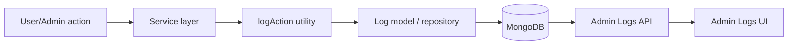

## 4.7 Role-based administration workflow

The current backend exposes three roles in the auth service: **Admin**, **Project Manager**, and **User**.

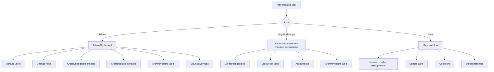

## 5. Backend Layer Workflow

The backend follows a controller → service → repository → model/data-store style.

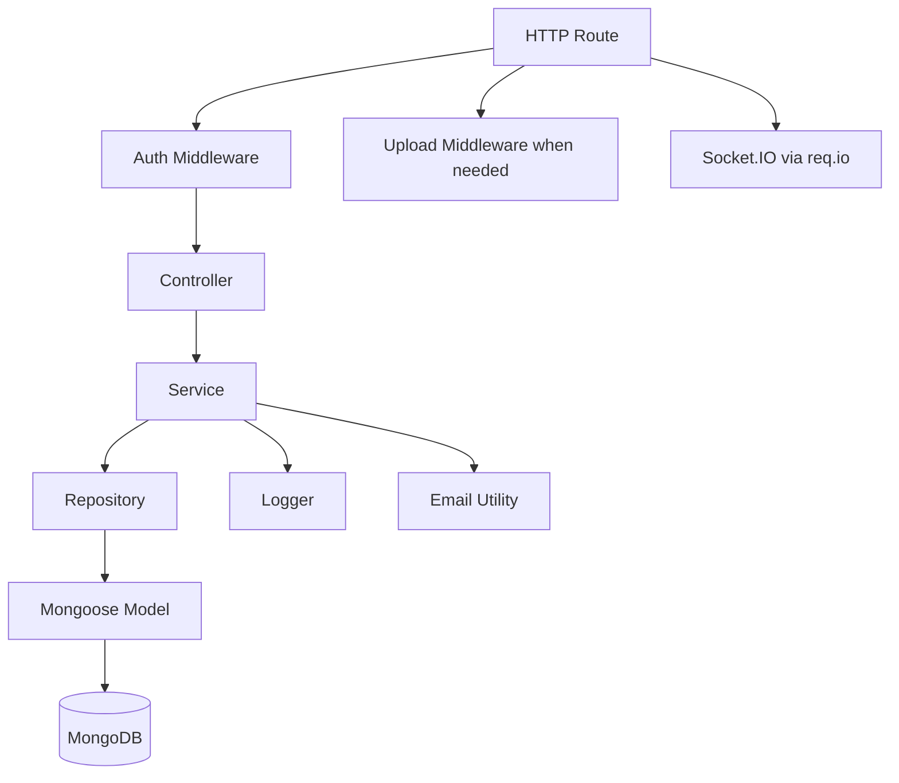

### Main backend modules

| Layer | Representative files | Responsibility |
|---|---|---|
| Server | `backend/server.js` | Express app, middleware, MongoDB connection, routes, Socket.IO server |
| Routes | `backend/routes/*.js` | Endpoint definitions and authorization composition |
| Middleware | `backend/middleware/authMiddleware.js`, `uploadMiddleware.js` | JWT validation, role authorization, multipart uploads |
| Controllers | `backend/controllers/*.js` | HTTP request/response boundary |
| Services | `backend/services/*.js` | Business rules and orchestration |
| Repositories | `backend/repositories/*.js` | Data access abstraction |
| Models | `backend/models/*.js` | Mongoose schemas and persistence model |
| Utilities | `backend/utils/*.js` | Logging, email, supporting infrastructure |

## 6. API Surface and Permissions

### Authentication

- `POST /api/auth/register`
- `POST /api/auth/login`
- `POST /api/auth/forgotpassword`
- `PUT /api/auth/resetpassword/:token`
- `GET /api/auth/me` — authenticated
- `GET /api/auth/users` — Admin / Project Manager
- `PUT /api/auth/users/:id/role` — Admin
- `PUT /api/auth/users/:id` — Admin

### Projects

- `GET /api/projects` — authenticated
- `GET /api/projects/:id` — authenticated
- `POST /api/projects` — Admin / Project Manager
- `PUT /api/projects/:id` — Admin / Project Manager
- `DELETE /api/projects/:id` — Admin

### Tasks

- `GET /api/tasks` — authenticated
- `POST /api/tasks` — Admin / Project Manager
- `GET /api/tasks/archived` — Admin / Project Manager
- `PUT /api/tasks/:id` — authenticated
- `DELETE /api/tasks/:id` — Admin / Project Manager
- `POST /api/tasks/:id/upload` — authenticated
- `PATCH /api/tasks/:id/archive` — Admin / Project Manager
- `PATCH /api/tasks/:id/restore` — Admin / Project Manager

### Comments

- `GET/POST /api/comments/:taskId`
- `GET/POST /api/comments/project/:projectId`

### Logs

- `/api/logs` route group for system activity visibility.

## 7. Data Model Relationships

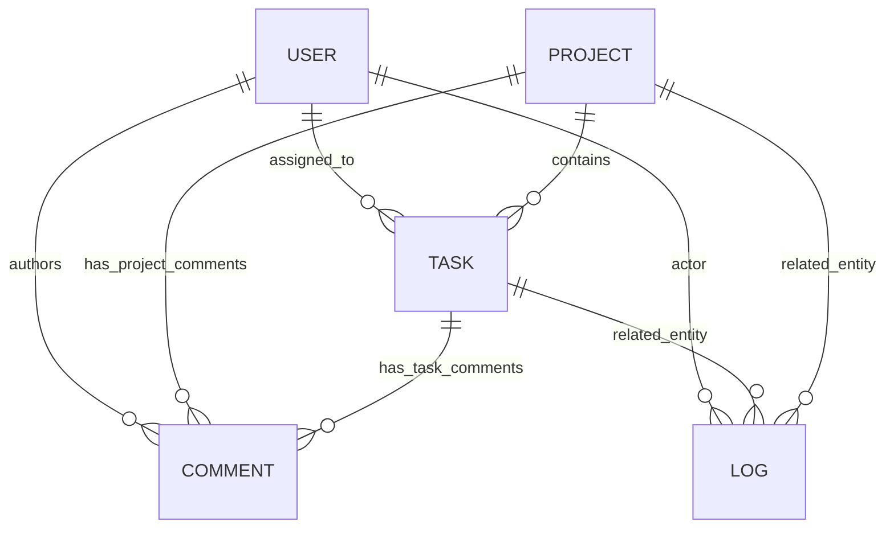

Core entities present in the repository:
- **User**
- **Project**
- **Task**
- **Comment**
- **Log**

## 8. Frontend State/Data Flow

Redux Toolkit is used to keep client state synchronized with REST responses.

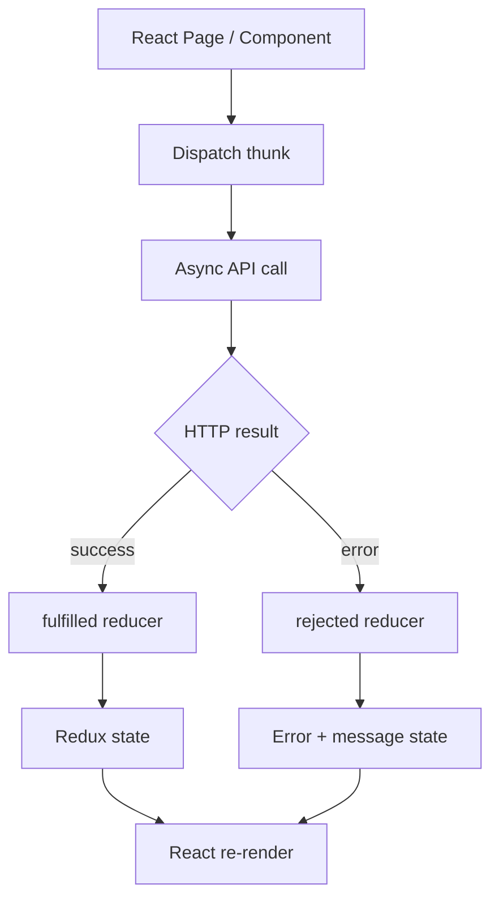

Implemented state slices include:
- `authSlice`
- `taskSlice`
- `projectSlice`
- `commentSlice`

The store combines these slices and provides application-wide state to the React UI.

## 9. Complete End-to-End Example: Create and Assign a Task

1. An Admin or Project Manager opens the task UI.
2. The task form collects title, description, project, assignees, priority and due date.
3. The component dispatches the Redux `createTask` thunk.
4. The API client sends `POST /api/tasks`.
5. The backend `protect` middleware verifies the Bearer JWT and loads the user.
6. `authorize('Admin', 'Project Manager')` validates the role.
7. The task controller calls the task service.
8. The task service validates the referenced project and creates the task through the repository.
9. The service records a `TASK_CREATED` activity.
10. Socket.IO emits a task-created event for connected clients.
11. When assignees are present, task-assignment emails are sent.
12. The JSON response returns to the frontend.
13. The Redux fulfilled reducer adds the task to local state.
14. The UI re-renders with the new task.

## 10. Complete End-to-End Example: User Updates a Task

1. User opens a task in the dashboard/Kanban board.
2. The UI dispatches `updateTask`.
3. The frontend calls `PUT /api/tasks/:id`.
4. The JWT middleware authenticates the request.
5. The controller forwards the update to the service.
6. The service validates the update and persists it through the repository.
7. The backend can emit a real-time task-update event and create an activity-log entry.
8. The API returns the updated task.
9. `taskSlice` replaces the matching task in Redux state.
10. The Kanban/dashboard updates immediately.

## 11. Operational Workflow

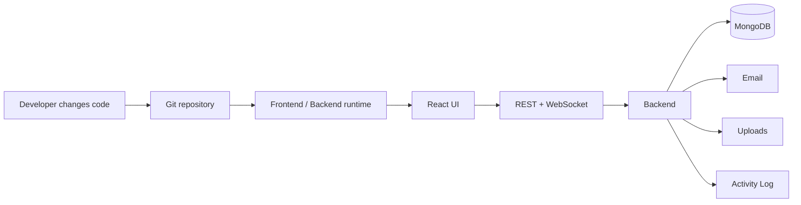

## 12. Repository-to-Workflow Mapping

### Frontend
- `frontend/src/App.jsx` — top-level application/routing composition.
- `frontend/src/main.jsx` — frontend bootstrap.
- `frontend/src/services/api.js` — HTTP client.
- `frontend/src/app/store.js` — Redux store.
- `frontend/src/features/*` — domain-specific client state and async thunks.
- `frontend/src/components/PrivateRoute.jsx` — protected/role-aware navigation.
- `frontend/src/pages/user/*` — user/project/task experience.
- `frontend/src/pages/admin/*` — administrative experience.

### Backend
- `backend/server.js` — application entry point.
- `backend/routes/*` — REST endpoint definitions.
- `backend/controllers/*` — request handlers.
- `backend/services/*` — business logic.
- `backend/repositories/*` — persistence abstraction.
- `backend/models/*` — database models.
- `backend/middleware/*` — authorization/upload pipeline.
- `backend/utils/logger.js` — activity logging.
- `backend/utils/sendEmail.js` — email delivery.

## 13. Notes on the Implemented Architecture

This documentation intentionally follows the code currently present in the repository. The repository also contains a project-summary document describing intended capabilities such as JWT authentication, role-based access control, Socket.IO communication, Nodemailer email, Multer uploads, Redux Toolkit, and Tailwind styling; the implementation contains the corresponding route/module structure.

Where the repository describes a capability at the planning level but the exact client-side integration is spread across multiple files, this document treats the actual route/module relationships as the source of truth.

---

## Visual Summary

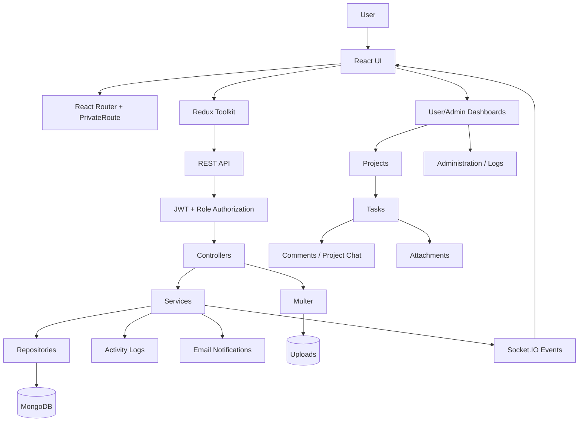

**Repository:** `MathewPaul2109/NESA-Task-Management`  
**Primary branch inspected:** `master`
